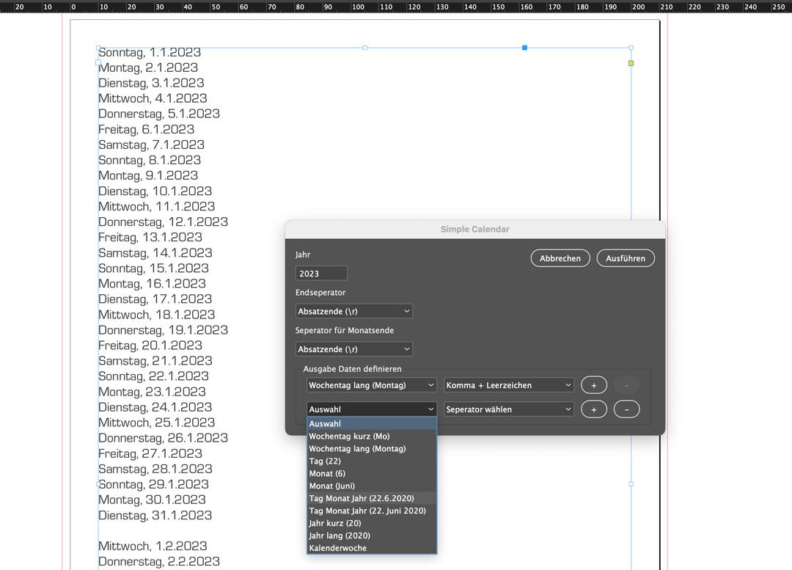

# InDesign Script Einfacher Kalender

Dieses Script erstellt einen einfache Liste von Kalenderdaten in ein ausgewähltes Textfeld. Über einen Dialog kann die Ausgabe angepasst werden.

## Installation

Die [SimpleCalendar.js](SimpleCalendar.js) im Scripte-Ordner von InDesign ablegen. 
So installierst Du in InDesign Scripte: [Homepage InDesignScript](https://www.indesignscript.de/indesign-skript-installieren/)

## Anwendung

Zum ausführen des Script muss ein Dokument geöffnet sein und ein Textrahmen aktiv sein. 

### Einstellungen

**[Ausgabe Daten definieren]** Im ersten Feld wird das Format des Datum festgelegt, im zweiten, mit welchem Seperator es am Ende abgeschlossen werden soll. Mit klick auf '+' wird ein weiters Datenfeld hinzugefügt, mit '-' können Felder entfert werden.

**[Endseperator]** Hier kann ein abschließender Seperator (am Ende der Datenreihe) festgelegt werden. ('Auswahl' fügt keinen Seperator an)

<b>Update 20.12.22</b> 
**[Seperator für Monatsende]** Hier kann ein abschließender Seperator für das Monatsende festgelegt werden. So können die einzelnen Monate getrennt werden. ('Auswahl' fügt keinen Seperator an)
  
 

### Anpassungen

Das Script kann einfach an die eigenen Bedürfnisse angepasst werden.
